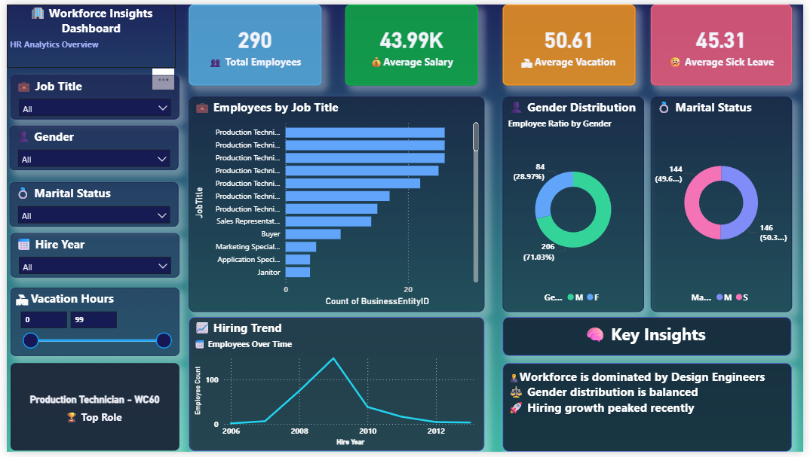

# 📊 HR Analytics Dashboard (Power BI)

## 🚀 Project Overview

This project presents an **interactive HR Analytics Dashboard** built using Power BI to analyze workforce trends, employee distribution, and key HR metrics.

---

## 📸 Dashboard Preview

---

## 🎯 Key Features

* 👥 Total Employees Overview
* 💰 Average Salary Insights
* 🏖️ Vacation & Sick Leave Analysis
* 📊 Employees by Job Title
* ⚖️ Gender Distribution
* 💍 Marital Status Breakdown
* 📈 Hiring Trend Over Time

---

## 🧠 Key Insights

* 💡 Workforce is dominated by **Design Engineers**
* 💡 Gender distribution is **balanced**
* 💡 Hiring trend has **increased in recent years**

---

## 🛠️ Tools & Technologies

* Power BI
* Data Visualization
* DAX (Data Analysis Expressions)

---

## 📂 Files Included

* `HR_Analytics_Dashboard.pbix` → Power BI file
* `dashboard-preview.png` → Dashboard screenshot

---

## 📌 How to Use

1. Download the `.pbix` file
2. Open in Power BI Desktop
3. Interact with filters and visuals

---

## 🌟 Connect With Me

If you like this project, feel free to ⭐ the repo and connect with me on LinkedIn!

---
